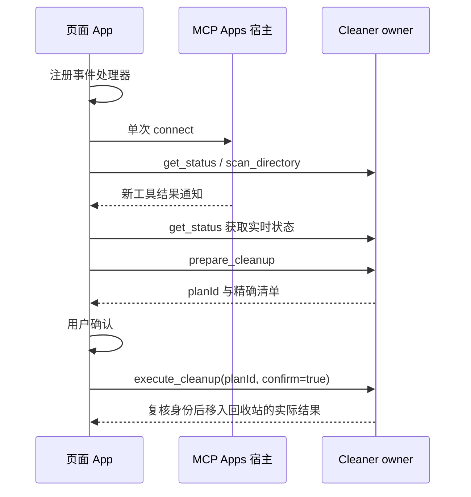

# 磁盘清理 owner 与端口

`Cleaner`（app 层）是扫描、候选指纹、清理计划与执行结果的唯一 owner；server、面板和模型都只经 `DiskCleaner` 读写。UI 只保存选择、筛选、分页和当前 planId，不复制候选或结果。

- 扫描只读元数据，同一时刻只有一个扫描或清理（busy admission 在任何 await 之前完成）。新扫描使旧计划失效；取消或失败的扫描不能生成计划。
- 计划 5 分钟过期，单次最多 100 个文件；同一 planId 重复执行返回已有执行，不重复移动。
- 执行前逐项复核规范路径、祖先未被替换、单链接、dev/ino/size/mtime/ctime；任何变化跳过。只移入系统回收站，回收站不可用时拒绝，绝不降级永久删除。
- 进程重启后状态清空，必须重扫；历史工具输出只用于打开面板。
- 分页 ≤ 20 条、候选路径 ≤ 1024 字符，structuredContent 保持在 64 KiB 以内。

## 独立仓库与页面通信

源码位于 `ui-plugins/disk-cleaner`，安装内容位于 `plugins/disk-cleaner`。页面仅使用官方 MCP Apps SDK，只有一个 App 和一次连接；工具结果、主题处理器先于连接注册。新的工具结果只触发 `get_status`，不能用历史输出覆盖 Cleaner 的当前状态。主题事件只更新显示，不触发扫描或清理。

迁移保持扫描、保护目录、指纹复核、计划过期、重复执行、取消和回收站失败语义。验证包括现有单测、独立产物、真实 App/AppBridge 浏览器通信及扫描→取消确认→确认→回收→重扫。测试只使用生成的临时文件，系统回收站由隔离目录替代。真实桌面安装和未运行的平台须另行记录。

插件身份：目录和清单使用 `disk-cleaner`，对应 MCP 页面资源使用 `ui://disk-cleaner/` 命名空间；客户端、服务端与集成测试保持一致。
